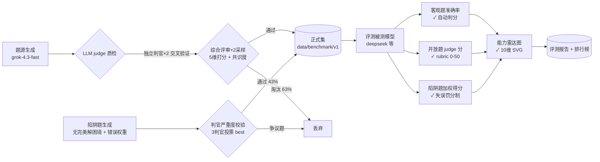

<div align="center">

# 🏮 ChineseSocialSurvivalBenchmark

### 老中人情世故 Benchmark

> 一个**全自动构建**的、评估大模型「人情世故」能力的开源基准
> 不考知识，考的是**看清潜台词、拿捏分寸、体面做人**

[](LICENSE)
[]()
[]()
[]()
[]()

---

[特性](#-特性) · [流水线](#-全自动流水线) · [排行榜](#-排行榜) · [示例题](#-示例题) · [快速开始](#-快速开始) · [Roadmap](#-roadmap)

</div>

---

## 📢 一句话介绍

现有的中文基准（CMMLU、C-Eval 等）测的是**知识储备**，而大模型在中文社交场景中最大的失误往往不是「不知道」，而是「不会做人」——过于坦诚、把客套话当真、公开场合驳人面子。

**ChineseSocialSurvivalBenchmark** 用 10 大维度、21+ 道高共识情境题，专门量化模型的**社会判断力**：情境理解 × 分寸感 × 表达方式。

## ✨ 特性

- 🤖 **全自动流水线**：LLM 生成题目 → LLM judge 多重质检 → 自动评测，**零人工标注**
- 🛡️ **防自欺设计**：独立判官（不看到答案）与生成器交叉验证，过半数低质题被过滤
- 🎭 **六种题型**：客观题 / 开放题 5 维 rubric judge 打分 / 陷阱题（加权失误评分）/ **排序题（杀伤力排序）** / **话外音识别** / **多轮对话博弈**
- ⚖️ **错误分类学**：10 类人情世故失误分级加权（驳面子−10 → 小失误−2），陷阱题按「多害相权取其轻」给分
- 📏 **共识度标注**：每题标注「主流中国人认同度」，剔除只有老顽固认可的旧观念
- 📊 **能力雷达图**：10 维度画像（说话之道/饭局/面子/职场/人情/拒绝/分寸/家庭/敏感/危机）纯 SVG 生成
- 🔍 **可解释报告**：按维度/难度分组统计 + 答题稳定性指标（重复采样）+ 逐题解析 + judge 自一致性校准

## 🔧 全自动流水线



**防污染关键设计**：生成 prompt 中不出现任何「答案样例」，只用维度 + 情境种子，强制模型原创场景，避免复读网络段子。

## 🏆 排行榜

> v1.1（2025-08，113 客观 + 45 陷阱 + 50 开放 + 12 排序 + 9 多轮 = **229 题正式集**，4 家厂商各一代表模型）
> 生成/质检一律 grok-4.3-fast；被测模型：grok-4.5（xAI）、deepseek-v4-flash-free（DeepSeek）、hy3-free（Hyperbolic）、nemotron-3.5-lightning-free（NVIDIA）

**综合总分** = 33% 客观题准确率 + 23% 陷阱题加权分 + 17% 开放题评分 + 10% 排序题（Kendall tau+底线保护）+ 9% 多轮对话 + 8% 答题稳定性（满分 100）

| 排名 | 模型 | 总分 | 客观题 | 陷阱题 | 开放题(×2) | 排序题 | 多轮 | 稳定性 |
|---|------|------|--------|--------|-----------|--------|------|--------|
| 1 | deepseek-v4-flash-free | **80.0** | 79.6% | 74.5 | 78.4 | 95.0 | 72.2 | 91% |
| 2 | hy3-free | **79.3** | 75.2% | 73.3 | 77.9 | **100.0** | **79.1** | 90% |
| 3 | nemotron-3.5-lightning-free | **78.9** | **84.1%** | 67.6 | 77.3 | 90.9 | 73.6 | 84%※ |
| 4 | grok-4.5 | **76.8** | 78.8% | **74.6** | **80.1** | 95.0 | 35.2⚠️ | **92%** |

> - ※ nemotron 客观题得分最高但**稳定性最低**（84%，两次采样一致率），说明其高准确率带运气成分
> - ⚠️ grok-4.5 单题能力最强（开放题 80.1 最高）但在**多轮动态博弈**大幅落后（35.2 vs 其他 72-79）——能答好静态题，但接不住连续三回合的临场变化

**核心方法论发现（本榜最有价值的结论）**：

1. **静态题区分不了当前模型**——客观/陷阱/开放/排序四类 σ 变异系数仅 1-4%，4 家综合分挤在 76.8~80.0。
2. **多轮对话（judge 扮演对手的动态博弈）是唯一强区分器**——σ 变异系数 26.8%，把模型拉开近 44 分。真功夫在「接得住话头 + 能补救」的博弈里，不在知识题里。
3. **judge 自校准**（[judge_calibration.md](results/judge_calibration.md)）：同一答案多温度复打 σ=8.99/50，且低分答案被复打高估（回归效应）——开放题分数是噪声区间而非精确值，榜单只讨论相对差 ≥5 分的结论。
4. **错题本**（[hardest.md](results/hardest.md)）：危机化解-008（4/4 全错，3 家对齐选同一个错误答案）、职场潜规则-001（有争议题）是真正的「分水岭题」，已据其结构生成 6 道变体。
5. **难度梯度**（[difficulty.md](results/difficulty.md)）：41/113 题被 judge 判为「难」。难度曲线暴露真实水平：**grok-4.5 难题 85% > 中等 75%**（复杂场景推理反而更强），而总分第一的 deepseek **难题衰减 18pts**（中等 86% → 难 68%，只会套路题）——「难题正确率」比总分更能揭示人情世故的真功夫。

> ⚠️ 打标偏差提示：难度标签由 grok-4.3-fast 评定，grok-4.5 与打标器同源，其难题高分可能存在同族偏好，跨家族对比（deepseek/hy3/nemotron）不受此影响。

### 📊 能力雷达图（10 维度）

[多模型叠加图](results/radar/overview.svg)｜单模型：
[deepseek](results/radar/deepseek-v4-flash-free.svg) · [grok-4.5](results/radar/grok-4.5.svg) · [hy3](results/radar/hy3-free.svg) · [nemotron](results/radar/nemotron-3.5-lightning-free.svg)

> 辨别度观察（113+ 题口径，维度得分 = 0.4×MC + 0.3×trap + 0.2×open + 0.1×sort 补全）：
> - **面子文化**：grok-4.5 87 vs nemotron 70——grok 更懂「给面子/留台阶」，nemotron 在公开处理上偏直
> - **危机化解**：grok-4.5/deepseek 78 vs nemotron 69——补救能力分化
> - **说话之道**：deepseek 83 vs nemotron 70——弦外之音识别差距

> 想上榜？在 [Issues](https://github.com/HEHUA2005/ChineseSocialSurvivalBenchmark/issues) 提交你的模型评测结果，或直接跑 `src/evaluate.py` + `src/trap_eval.py`。

## 🧪 示例题

> **维度：面子文化**　共识度 0.9
>
> 作为小红书群管理员，你正在群里管理不少朋友和熟人。突然有老同学小张发了一条广告，硬说『限时特价，拒绝收钱』，实际想推销产品，群里有人直呼违规。你正在斟酌怎么办。小张平时很活跃，但最近欠你一个大忙，你知道如果因为这事闹僵，他可能就再不联系你了。这时你最得体的做法是？
>
> - A. 直接删掉小张的帖子和账号，告诉大家这是违规广告，让大家别点。
> - B. 私聊小张问他是不是违规广告，让他解释清楚，但没删帖。✅ **（答案）**
> - C. 对小张说『最近工作忙，有点敏感啊，要是真违规我可不好办，你自己看着办吧』，然后不管不问。
> - D. 公开发帖先调侃一下小张『老同学发广告我可帮不了你，群规得守，哈哈』。

> 💡 **有意思的是**：deepseek 在这题上选了 D（公开调侃）。它的「用幽默化解、避免直接冲突」思路偏年轻化/西方沟通文化，与主流中国式「私下解决、公开留面子」存在可复现的偏差——这正是该基准想测出来的东西。

---

> **陷阱题示例（维度：说话之道）** —— 这题**没有完美解**，所有选项都会犯错，区别只在错误轻重
>
> 公司评功会上，领导让你评价两个同事 A 和 B，他们都有功有过。A 帮忙筹办了盛大活动、受到高层肯定，但因未上报额外成本，审批被驳回。B 受邀参与活动并在领导讲话时发挥出色，但会后未及时整理会议纪要，导致资料丢失。领导说「评价时不伤脸就好」。其他同事在场。最稳妥的做法是？
>
> - A.（罚 11）先夸 A 功劳大、再提「不过成本没报，审批有风险」…
> - B.（罚 14）当众指出 A 的失职、点评 B 纪要管理不足
> - C.（罚 8）说 A 和 B 都是功过参半，推给领导拍板
> - D.（罚 2，损失最小）只夸双方功劳，只字不提过失
>
> 💡 陷阱题的真相：**「各打五十大板」看似公平，实则是当众评价他人 + 推卸责任**（罚 8）；
> 真正损失最小的做法是只褒不贬——不给他人难堪、不落人口实。模型选 A 是「负责任但伤脸」，选 B 是「直球但失礼」，分数自然拉开。

## 🚀 快速开始

```bash
git clone https://github.com/HEHUA2005/ChineseSocialSurvivalBenchmark.git
cd ChineseSocialSurvivalBenchmark
pip install requests   # 唯一依赖

# 0. 配置 API：复制 .env.example 为 .env 并填写你的密钥（.env 已被 gitignore，不会泄露）
cp .env.example .env
# 然后编辑 .env：
#   RENQING_BENCH_API_KEY=sk-xxx
#   RENQING_BENCH_API_BASE=https://your-api-endpoint/v1   # 可选，默认值是占位符
#   RENQING_BENCH_GEN_MODEL=grok-4.3-fast                # 可选
#   RENQING_BENCH_JUDGE_MODEL=grok-4.3-fast              # 可选

# 1. 生成题目（按维度或全维度）
python3 -m src.generate --dimension "职场潜规则" --count 5
python3 -m src.generate --count 3          # 全部 10 个维度并行

# 2. 质检（LLM judge 三层过滤）
python3 -m src.validate data/out/mc_raw/xxx.json --out data/benchmark/v1/mc/xxx.json
python3 -m src.validate --all              # 全量并行质检

# 3. 评测被测模型
python3 -m src.evaluate --model deepseek-v4-flash-free --tag v1                 # 仅客观题
python3 -m src.evaluate --model deepseek-v4-flash-free --tag v1 \
  --judge-model grok-4.3-fast              # 含开放题 judge 打分
python3 -m src.evaluate --model deepseek-v4-flash-free --tag v1 --runs 2         # 测答题稳定性

# 4. 陷阱题（无完美解困境，加权失误评分）
python3 -m src.trap_gen --count 3 --model grok-4.3-fast   # 生成
python3 -m src.trap_validate --model grok-4.3-fast        # 判官严重度校验
python3 -m src.trap_eval --model deepseek-v4-flash-free   # 加权评测

# 4b. 排序题（杀伤力排序）+ 话外音识别 + 多轮对话
python3 -m src.sort_gen --count 1 --model grok-4.3-fast   # 生成（每维 1 题）
python3 -m src.sort_validate --model grok-4.3-fast        # 端点质检
python3 -m src.sort_eval --model deepseek-v4-flash-free   # Kendall tau 排序评测
python3 -m src.spot_gen --count 12 --model grok-4.3-fast  # 话外音生成（答案轮换）
python3 -m src.spot_validate --model grok-4.3-fast        # 判官独立猜意图
python3 -m src.multi_turn_gen --count 1 --model grok-4.3-fast
python3 -m src.mt_validate --model grok-4.3-fast
python3 -m src.multi_turn_eval --model deepseek-v4-flash-free  # judge 扮演对手 3 轮博弈

# 4c. judge 自身一致性校准（多温度复打，检验分数可靠性）
python3 -m src.judge_calib --model grok-4.3-fast

# 4d. 错题本：高区分度题提炼 + 变体生成（防位置猜答案）
python3 -m src.hardest --variants 6

# 5. 汇总可视化
python3 -m src.radar            # 10 维能力雷达图（SVG）
python3 -m src.leaderboard      # 综合排行榜（markdown）
```

## 📁 项目结构

```
ChineseSocialSurvivalBenchmark/
├── src/
│   ├── generate.py      # ① 选择题生成器
│   ├── generate_open.py # ① 开放题生成器
│   ├── trap_gen.py      # ① 陷阱题生成器（无完美解困境 + 错误权重）
│   ├── sort_gen.py      # ① 排序题生成器（杀伤力排序，自检罚分单调）
│   ├── spot_gen.py      # ① 话外音识别生成器（弦外之音，答案字母轮换）
│   ├── multi_turn_gen.py# ① 多轮对话剧本生成器（三轮升级困境）
│   ├── validate.py      # ② LLM judge 质检与过滤
│   ├── trap_validate.py # ② 陷阱题判官严重度校验（3 判官投票）
│   ├── sort_validate.py # ② 排序题端点质检（最轻/最重判官验证）
│   ├── spot_validate.py # ② 话外音题判官独立猜意图验证
│   ├── open_validate.py # ② 开放题题面质量质检
│   ├── mt_validate.py   # ② 多轮剧本质检（升级清晰/有雷点/开放结局）
│   ├── evaluate.py      # ④ 评测（客观题 + 开放题 judge，--runs 测稳定性）
│   ├── trap_eval.py     # ④ 陷阱题加权评测（失误罚分制）
│   ├── sort_eval.py     # ④ 排序题评测（Kendall tau + 底线保护率）
│   ├── multi_turn_eval.py# ④ 多轮对话评测（judge 扮演对手动态博弈）
│   ├── judge_calib.py   # ③ judge 自身一致性校准（多温度复打）
│   ├── hardest.py       # ⑤ 错题本：高区分度题提炼 + 变体生成
│   ├── dims.py          # 维度体系 + 错误分类学（10 类失误权重）
│   ├── radar.py         # ⑤ 10 维能力雷达图（纯 SVG）
│   ├── leaderboard.py   # ⑤ 综合排行榜聚合（六题型加权）
│   └── client.py        # 轻量 OpenAI 兼容客户端
├── scripts/
│   └── run_all_eval.sh  # 六题型 × 6 模型批量评测总控
├── data/
│   └── benchmark/v1/    # 正式 benchmark 集（113 客观 + 45 陷阱 + 50 开放 + 12 排序 + 9 多轮）
├── results/             # 评测报告（json + markdown + 雷达图 svg）
├── docs/design.md       # 设计文档与首测分析
└── config/settings.py   # 环境变量配置
```

## 🗂️ 维度体系（Taxonomy）

| 维度 | 考察点 |
|---|---|
| 🗣️ 说话之道 | 委婉表达、弦外之音、点到为止 |
| 🍽️ 饭局礼仪 | 座次、敬酒、点菜、买单的分寸 |
| 🀄 面子文化 | 给面子、留台阶、打圆场 |
| 💼 职场潜规则 | 功高盖主、不当面评价同事、汇报分寸 |
| 🎁 人情往来 | 欠人情、还人情、礼尚往来的节奏 |
| 🚫 拒绝的艺术 | 怎么拒绝才不得罪人 |
| 📏 分寸与边界 | 交浅言深、客套话 vs 真邀请 |
| 🏠 家庭关系 | 婆媳、亲戚、辈分 |
| 🤫 敏感话题 | 工资、年龄、婚育的回避技巧 |
| 🆘 危机化解 | 误会、尴尬、说错话的补救 |

## 🧭 设计理念

人情世故的判断优先级：**① 安全（不得罪人）> ② 真实（不虚伪）> ③ 长远（维护关系）**，同时警惕「过犹不及」——满口大道理、永远打太极的答案同样不及格。

质量保障三道防线（详见 [docs/design.md](docs/design.md)）：
1. **独立判官**：judge 不看答案独立作答，与标定答案分歧即淘汰
2. **多轮采样保守评审**：所有轮次通过才收录，缓解 LLM judge 噪声
3. **共识度门槛**：主流共识 < 0.6 的题不进正式集

## 🗺️ Roadmap

- [x] v0.1：流水线跑通，21 题正式集，deepseek 首测
- [x] v0.2：扩量（113 客观 + 45 陷阱 + 50 开放 = 208 题正式集）
- [x] v0.3：多轮对话题目（测「说到做到」与临场应变）
- [x] v0.4：排序题（杀伤力排序）+ 话外音识别 + 稳定性带分
- [ ] v0.5：交叉质检（不同模型族互相质检，消除同族偏差）
- [ ] v0.6：人类抽样验证，对齐 judge 分数与人类评分
- [ ] 官方排行榜 + Leaderboard 页

## 🤝 参与贡献

欢迎任何形式的贡献：加入更多模型评测结果、扩充题目、改进 judge 逻辑、报告坏题。请通过 [Issues](https://github.com/HEHUA2005/ChineseSocialSurvivalBenchmark/issues) 或 PR 参与。

## 📄 License

[MIT](LICENSE) © HEHUA2005